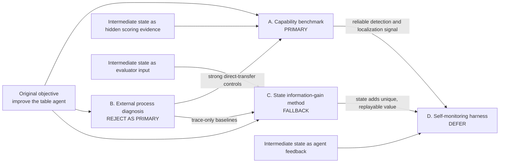

# Alternative Research Formulations

**Status:** Phase 1 decision analysis; no novelty or experimental claim
**Date:** 2026-08-26
**Frozen ProfiliTable baseline:** `Eularioal/ProfiliTable@f023ec4b754555000a659b93fd514645c55e3cec`
**Paper-linked code checked:** [`PKU-DAIR/ProfiliTable@f495062`](https://github.com/PKU-DAIR/ProfiliTable/commit/f495062699e1364978f5032bfbd7b6dac22144e9)

## Decision in one paragraph

Choose **A, a table-agent capability benchmark**, as the primary formulation. Its main track asks whether an agent can execute the latest user requirements, detect a semantic failure, localize it, and recover without receiving benchmark-injected intermediate table states. Keep **C, the incremental value of state-grounded evaluation**, as the fallback hypothesis: state earns a method claim only if it solves reference-hidden cases that the strongest dialogue/code/trajectory baselines miss and changes a decision such as repair success or false acceptance. Do not choose B as the primary because [DataSpace](https://arxiv.org/abs/2608.03451v1), [AgentRx](https://arxiv.org/abs/2602.02475v1), [FALAT](https://arxiv.org/abs/2606.00765v1), [DRIFT](https://arxiv.org/abs/2606.02060v2), [TrajDebug](https://arxiv.org/abs/2608.06346v1), and [DataTrace](https://github.com/HKUSTDial/datatrace/commit/48a89e59b4aeef5a01d5ed68c1a1b4d4dc84a411) already cover most generic process-diagnosis ingredients. Defer D until an evaluator has demonstrated reliable, decision-relevant signal.

## Research-space map

The diagram separates three roles for state. A benchmark may record checkpoints for scoring while withholding them from the evaluated agent; an external evaluator may receive them in an ablation; an integrated agent may receive selected state evidence only after the earlier two roles have been validated.

## Shared claim ceiling

Existing work already covers the following components:

- realistic table/spreadsheet execution and final-output scoring: [ProfiliTable](https://arxiv.org/abs/2605.12376v2), [SpreadsheetBench](https://arxiv.org/abs/2406.14991v2), and [SpreadsheetBench 2](https://arxiv.org/abs/2606.29955v1);
- evolving intent and interruption: [CITBench](https://arxiv.org/abs/2608.00018v1), [Evolving User Intent](https://arxiv.org/abs/2607.20734v1), [AgentChangeBench](https://arxiv.org/abs/2510.18170v1), and [InterruptBench](https://arxiv.org/abs/2604.00892v1);
- state-grounded spreadsheet reflection and environment-aware judging: [SheetMind](https://arxiv.org/abs/2506.12339v2) and [AJ-Bench](https://aclanthology.org/2026.findings-acl.1269/);
- first, critical, persistent, source, propagation, recovery, and counterfactual diagnosis: [DataSpace](https://arxiv.org/abs/2608.03451v1), [AgentRx](https://arxiv.org/abs/2602.02475v1), [FALAT](https://arxiv.org/abs/2606.00765v1), [DRIFT](https://arxiv.org/abs/2606.02060v2), and [TrajDebug](https://arxiv.org/abs/2608.06346v1);
- executable lineage, row witnesses, replay, and repair: [mlinspect](https://doi.org/10.1007/s00778-021-00726-w), [BigDebug](https://doi.org/10.1145/2884781.2884813), [BigSift](https://doi.org/10.1145/3127479.3131624), and the code-first [DataTrace artifact](https://github.com/HKUSTDial/datatrace/commit/48a89e59b4aeef5a01d5ed68c1a1b4d4dc84a411);
- executable contracts, runtime verification, and localized or counterfactual repair: [Lean4Agent](https://arxiv.org/abs/2606.06523v2), [AgentSpec](https://arxiv.org/abs/2503.18666v3), [ContractSkill](https://arxiv.org/abs/2603.20340v3), and [CausalFlow](https://arxiv.org/abs/2605.25338v1).

**Inference:** the surviving research space is a conjunction, not a new ingredient: evolving/versioned table intent, executed table checkpoints, independently labeled error lifecycle, executable table witnesses, and evaluated localized recovery. No audited source in `NOVELTY_MATRIX.tsv` was found to cover that full conjunction. This is a candidate gap, not a novelty claim.

## Comparison of A–D

| Formulation | Evaluated subject | Primary scientific question | Intermediate state role | Strongest disconfirming work | Minimum resource requirement | Six-week feasibility | Decision |
|---|---|---|---|---|---|---|---|
| A. Table-agent capability benchmark | Table agent | Can an agent execute the latest table intent and detect, localize, and recover from its own semantic errors? | Hidden scoring evidence in the main track; no state injected into the agent | ProfiliTable, CITBench, SpreadsheetBench 2, SheetMind, evolving-intent suites | Four licensed tasks; independent oracles; instrumented traces; two annotators plus adjudication; several frozen agent baselines | Feasible only as a small, construct-validated pilot; not as a broad benchmark release | **Primary** |
| B. Process-diagnostic benchmark | External diagnosis model | Given a failed trajectory, can a model label violated requirement, source, propagation, recovery, and evidence? | Optional diagnostic input | DataSpace, AgentRx, FALAT, DRIFT, TrajDebug, DataTrace | Four traceable tasks; lifecycle annotation; five transfer adapters/reimplementations; two annotators plus adjudication; replay runner | Labels are feasible, but publishable differentiation is weak without the full table-specific conjunction | **Reject as primary; retain baselines** |
| C. Method-first state-grounded evaluator | External evaluator | Does executed table state add information beyond dialogue, code, and ordinary trace? | Controlled treatment variable | SheetMind, AJ-Bench, HINTBench, mlinspect, DataTrace | A/B assets plus checkpoint serialization, lineage handles, matched state/no-state inference budget, and replay checks | Feasible as a 16-case falsification study after Phase 2 | **Fallback** |
| D. Harness/self-monitoring integration | Integrated table-agent system | Can selective self-checking improve end-to-end task success at acceptable cost? | Agent-visible feedback | SheetMind, AgentSpec, ContractSkill, CausalFlow | Validated evaluator; isolated patch sandbox; policy/controller; matched retry/regeneration controls; end-to-end agent runs | Too dependent on reliable evaluator, repair interface, and larger runs for the first six weeks | **Defer** |

## A. Table-agent capability benchmark — primary

### Scientific question

Can a table agent maintain the active version of a user's requirements, execute them correctly, recognize a semantic failure, localize its source, and recover before submission under a reference-output-withheld protocol?

The capability ladder remains separable:

1. final execution correctness;
2. active-intent tracking;
3. calibrated self-detection, including abstention;
4. violated-clause and source-step localization;
5. recovery or localized repair.

### Inputs, gold, and state boundary

- The agent sees the user dialogue, source tables, ordinary tools, its own code, and normal runtime/tool feedback.
- The agent does **not** see gold active-intent annotations, reference output, `eval.py` internals, source-error labels, witness ledger, or benchmark-injected checkpoints.
- The scorer may use hidden versioned intent, final oracle, checkpoint replay, source/propagation/recovery labels, and executable witnesses.
- An oracle-intent condition may reveal the gold active contract, but it must be reported separately from the main track.

This formulation satisfies the requirement to retain a direction that does not depend on agent-visible intermediate table states.

### Strongest overlap and disconfirming evidence

- [CITBench](https://arxiv.org/abs/2608.00018v1) already evaluates interactive table tasks with intent changes.
- [Evolving User Intent](https://arxiv.org/abs/2607.20734v1), [AgentChangeBench](https://arxiv.org/abs/2510.18170v1), and [InterruptBench](https://arxiv.org/abs/2604.00892v1) already cover structured requirement change and adaptation.
- [SpreadsheetBench 2](https://arxiv.org/abs/2606.29955v1) already includes spreadsheet debugging.
- [SheetMind](https://arxiv.org/abs/2506.12339v2) already uses before/after spreadsheet state for reflection.

These sources block any claim based on one component alone. A survives only if the combined capability protocol and labels produce measurements unavailable from final success or intent tracking alone.

### Direct-transfer baselines

- ProfiliTable final evaluator as the outcome control;
- Task Shield-style active-intent/action alignment without table-state evidence;
- UserIntentBench/Evolving User Intent-style intent tracking;
- SheetMind-style reflection with ordinary before/after state available to the agent;
- AgentRx/DRIFT-style reference-hidden localization from dialogue, code, and ordinary trace;
- SpreadsheetBench 2-style debugging outcome.

The exact transfer contract is specified in `DIRECT_TRANSFER_BASELINE_PLAN.md`.

### Candidate contribution if evidence supports it

A validated capability benchmark in which final correctness, latest-intent tracking, self-detection, source localization, recovery, and repair are scored separately on executable table workflows. A conference-level contribution would also require stable annotations, evaluator coverage evidence, natural-failure relevance, contamination controls, and a result that changes system ranking or repair policy. No venue outcome is implied.

### Kill test

Stop A as a benchmark-contribution framing if any of the following holds:

- an audited existing benchmark matches the evaluated subject, main inputs, gold, and output labels;
- source-step or violated-clause labels are unstable after the annotation unit and boundary rules are frozen;
- self-detection/localization has no measurable headroom beyond final success and strongest transferred baselines;
- the new labels do not change acceptance, retry, repair, ranking, time, or cost decisions;
- selected ProfiliTable tasks lack independent semantic oracles or replayable checkpoints.

### Six-week execution plan

| Week | Bounded deliverable | Release condition |
|---|---|---|
| 1 | Phase 2 audit of task inventory, license/provenance, `eval.py` coverage, and checkpoint feasibility | Four real tasks have independent semantic-oracle plans; no raw data is committed |
| 2 | Frozen construct map and annotation unit; select filter/revision, aggregation grain, dedup/latest-record, and preservation cases | Each label maps to observable evidence and includes `AMBIGUOUS`/`INSUFFICIENT_EVIDENCE` |
| 3 | Stepwise clean references plus controlled lifecycle variants in an ignored local artifact area | Clean, persistent, recovered, and benign-equivalent variants share a documented source operation |
| 4 | Run final-only, intent-only, trace/code diagnosis, and state ablations on the same 16 instances | Same cases, backbone, budget, and hidden-gold boundary across methods |
| 5 | Blind annotation and executable witness replay; record natural failures separately if available | Agreement, confusion, adjudication, replay, and false-rejection results are reported |
| 6 | GO/PIVOT/STOP analysis; no automatic scaling | At least one decision-relevant capability gap survives and provenance/license are releasable |

### Fallback

If A has no defensible benchmark headroom but state produces unique diagnostic or repair value, pivot to C. If neither condition holds, stop novelty framing and treat the work as a domain integration/evaluator audit.

## B. Process-diagnostic benchmark — reject as primary

### Scientific question

Given a failed table-agent trajectory, can an external model identify the violated active requirement, source step, propagation path, recovery status, and supporting evidence?

### Strongest overlap and disconfirming evidence

- [DataSpace](https://arxiv.org/abs/2608.03451v1) defines the primary cause as the earliest observable, unrepaired divergence that determines or prevents the final submission.
- [AgentRx](https://arxiv.org/abs/2602.02475v1) localizes the first unrecovered failure using guarded constraints and trace evidence.
- [FALAT](https://arxiv.org/abs/2606.00765v1) models typed dependency, correction, and counterfactual sufficiency.
- [DRIFT](https://arxiv.org/abs/2606.02060v2) labels earliest harmful spans and claim dependencies without requiring a gold answer in the diagnosis input.
- [TrajDebug](https://arxiv.org/abs/2608.06346v1) explicitly separates resolved/active errors and terminal footprint.
- [DataTrace](https://github.com/HKUSTDial/datatrace/commit/48a89e59b4aeef5a01d5ed68c1a1b4d4dc84a411) already evaluates evidence-grounded database root cause and executable fixes, although its formal paper status is `DATA_INSUFFICIENT`.

### Direct-transfer baselines

The five required transfers—DataSpace, AgentRx, FALAT, DRIFT, and DataTrace—are the center of `DIRECT_TRANSFER_BASELINE_PLAN.md`. B is still useful as a controlled measurement layer for A and C; it is not the recommended paper identity.

### Candidate contribution if evidence supports it

Only the full conjunction of evolving table intent, table-specific executable witnesses, independently labeled source/propagation/recovery, and evaluated localized repair could distinguish B. A label-only table adaptation would be weak.

### Kill test

Stop B as a standalone direction if a reference-hidden transfer baseline reaches the annotation ceiling, if state evidence does not add unique replayable information, or if the table-specific labels collapse to existing lifecycle taxonomies without changing repair or acceptance.

### Six-week execution plan and fallback

The work would fit in six weeks only as a 16-instance transfer study, not as a mature benchmark:

| Week | Bounded B deliverable | Early stop |
|---|---|---|
| 1 | Freeze the annotation unit, lifecycle definitions, source-method visibility, and reference-withheld output contract | stop if source/persistence/recovery labels cannot be distinguished operationally |
| 2 | Normalize four qualified ProfiliTable workflows into a shared dialogue/action/observation representation | stop if transformation boundaries erase the source-step construct |
| 3 | Independently annotate the controlled lifecycle set and replay proposed witnesses | stop if agreement or replayability is inadequate |
| 4 | Run DataSpace-, AgentRx-, and DRIFT-style reference-hidden transfers; keep FALAT reimplementation explicitly specification-level | stop if a transfer already reaches the annotation ceiling |
| 5 | Run DataTrace-style artifact-graph localization and the state/no-state ablation at matched visibility | stop if table evidence is reconstructible from the ordinary trace or adds no correct cases |
| 6 | Audit direct overlap, false rejection, repair consequence, cost, and release provenance | retain B only as A's scoring/baseline layer unless the full conjunction survives |

If the conjunction fails, retain the transferred methods as baselines for A; do not publish B as a renamed first-error dataset.

## C. Method-first state-grounded evaluator — fallback

### Scientific question

Under the same reference-hidden task and trace, does access to executed intermediate table state improve violated-clause detection, source-versus-symptom localization, witness replay, or executable repair compared with dialogue, code, and ordinary trajectory alone?

### Required information-gain design

At minimum compare:

1. final artifact only;
2. dialogue plus final artifact;
3. dialogue plus code/ordinary execution trace;
4. the same input plus executed table checkpoints;
5. the same input plus row/cell/statistic lineage;
6. gold active-contract oracle as an upper bound, reported separately.

State must contain an executable observation that cannot be reconstructed from the no-state trace. Merely serializing tool output into a different format is not incremental evidence.

### Strongest overlap and disconfirming evidence

- [SheetMind](https://arxiv.org/abs/2506.12339v2) already reflects over spreadsheet before/after states.
- [AJ-Bench](https://aclanthology.org/2026.findings-acl.1269/) already benchmarks environment-aware judges, including Excel cases and selective evidence acquisition.
- [HINTBench](https://arxiv.org/abs/2604.13954v1) already contains State Constraint labels.
- [mlinspect](https://doi.org/10.1007/s00778-021-00726-w), [BigDebug](https://doi.org/10.1145/2884781.2884813), and [DataTrace](https://github.com/HKUSTDial/datatrace/commit/48a89e59b4aeef5a01d5ed68c1a1b4d4dc84a411) already provide state, lineage, evidence paths, or replay.

### Candidate contribution if evidence supports it

A controlled information-gain result showing when executable table state changes reference-hidden attribution or repair, plus a cost-aware evidence-selection method if full state access is expensive. This is method-worthy only after the no-state comparison is strong and the result reproduces across multiple semantic families.

### Kill test

Pivot away from C if:

- the strongest no-state baseline matches the state-aware condition;
- apparent gains vanish when gold/reference leakage is removed;
- state adds only verbose explanations, not exact localization, witness replay, repair, false acceptance, or cost improvements;
- state creates more than one new false rejection among the clean, benign-equivalent, and recovered controls in the 16-case gate;
- unique wins occur in fewer than three cases or fewer than three semantic families.

The last two thresholds are **design proposals for the Stage 0 gate**, not statistical claims.

### Six-week execution plan and fallback

Weeks 1–3 share A's task/oracle/annotation audit. Weeks 4–5 run the pre-registered state ablation and witness replay. Week 6 either advances a state-information-gain hypothesis, pivots to an intent/contract problem if gold-contract performance is high but predicted-contract performance fails, or stops method novelty. If C fails, retain state only as hidden evaluator evidence for A.

## D. Harness/self-monitoring integration — defer

### Scientific question

Can a table agent use selected verifier evidence to decide when to accept, retry, localize, or patch its own workflow, improving end-to-end semantic success at acceptable cost?

### Strongest overlap and disconfirming evidence

- [SheetMind](https://arxiv.org/abs/2506.12339v2) already implements spreadsheet reflection and retries.
- [AgentSpec](https://arxiv.org/abs/2503.18666v3) already enforces runtime rules at action boundaries.
- [ContractSkill](https://arxiv.org/abs/2603.20340v3) already combines executable step contracts, deterministic verification, and localized repair in web agents.
- [CausalFlow](https://arxiv.org/abs/2605.25338v1) already uses counterfactual suffix reruns for attribution and repair.

### Direct-transfer baselines

- **No-monitor:** one normal ProfiliTable execution with no verifier feedback.
- **Matched retry:** retry once with the same failure signal but no localization evidence.
- **Whole regeneration:** regenerate the full program after failure, matching attempts and model budget.
- **SheetMind-style reflection:** expose ordinary before/after table state and request accept/retry/replan.
- **AgentSpec-style boundary enforcement:** check declared active-intent rules before a pending action is committed.
- **ContractSkill-style local patch:** return a failed assertion, step identifier, and permitted local edit class, then verify the patch.
- **CausalFlow-style counterfactual rerun:** replace one candidate step and rerun the suffix in an isolated copy, with gold references withheld.

The integrated condition must beat the strongest matched retry/regeneration control, not only the unassisted agent.

### Candidate contribution if evidence supports it

A table-specific, selective self-monitoring policy that improves semantic task success while reducing unnecessary whole-program regeneration. The claim would require evaluator reliability, controlled repair scope, and end-to-end comparisons against simple retry/regeneration.

### Kill test

Do not build D if evaluator false rejections are not controlled, if local patches do not outperform whole-program regeneration at matched cost, if state acquisition dominates runtime, or if A/C cannot show a stable signal that the harness can act on.

### Conditional six-week falsification plan and fallback

D remains deferred because its prerequisite evaluator does not yet exist. If A/C later releases that prerequisite, the smallest six-week falsification plan is:

| Week | Bounded D deliverable | Early stop |
|---|---|---|
| 1 | Freeze evaluator version, confidence/abstention contract, and isolated-copy execution policy | stop if clean/recovered controls exceed the false-block budget |
| 2 | Establish no-monitor, matched-retry, and whole-regeneration controls under identical attempts and model budget | stop if run variance prevents paired case-level comparison |
| 3 | Add the smallest accept/retry/localize controller; expose only cited evidence, not gold labels or evaluator internals | stop if the controller cannot act on the evaluator output deterministically |
| 4 | Add one restricted local-patch path plus hidden-check replay; keep full regeneration as a control | stop if patches cannot be scoped or safely isolated |
| 5 | Run paired end-to-end cases and record task success, false blocks, repair scope, attempts, tokens, latency, and cost | stop if self-monitoring fails to beat matched retry/regeneration |
| 6 | Audit causal attribution, failure cases, and cross-task transfer; decide whether a system claim exists | do not scale if gains depend on oracle visibility or one task family |

The fallback is not another harness design: return to A's benchmark or C's evaluator gate.

## Cross-axis findings that change the decision

| Search axis | Decision-relevant finding | Effect on formulation |
|---|---|---|
| Table/spreadsheet capability | Final execution, evolving interaction, debugging, and state reflection all have direct predecessors | A must separate capabilities and prove decision relevance; no single-component first claim |
| Evolving/latent intent | Active-intent graphs, revisions, interruptions, and recovery timing already exist | Intent must be aligned to actual table effects, not scored only as belief text |
| Failure localization | Persistent, first-unrecovered, decisive, harmful, and error-lifecycle definitions already exist | Reuse and compare definitions; do not rename one as novelty |
| Data/database provenance | Operator DAGs, tuple/record lineage, minimal failure inputs, replay, and evidence paths already exist | Executable witnesses are a transfer, unless their combination with evolving table intent changes outcomes |
| Contract/verification/repair | Formal predicates, runtime policies, generated constraints, active evidence, and localized/counterfactual repair already exist | Gold visibility, contract correctness, verifier coverage, and semantic repair scope must be explicit |
| Benchmark methodology | Validity, reliability, leakage, mutants-versus-real-faults, difficulty, and licensing can invalidate the whole result | Stage 0 remains a construct audit; scaling is blocked until these checks pass |

## Allowed interpretation at the end of Phase 1

The current evidence supports a **research decision**, not novelty:

> Test the table agent's full capability ladder first, with intermediate state hidden from the agent in the main condition. Use process-diagnosis methods as direct-transfer baselines. Promote state to the method question only if controlled ablation shows unique, replayable, decision-relevant value.
